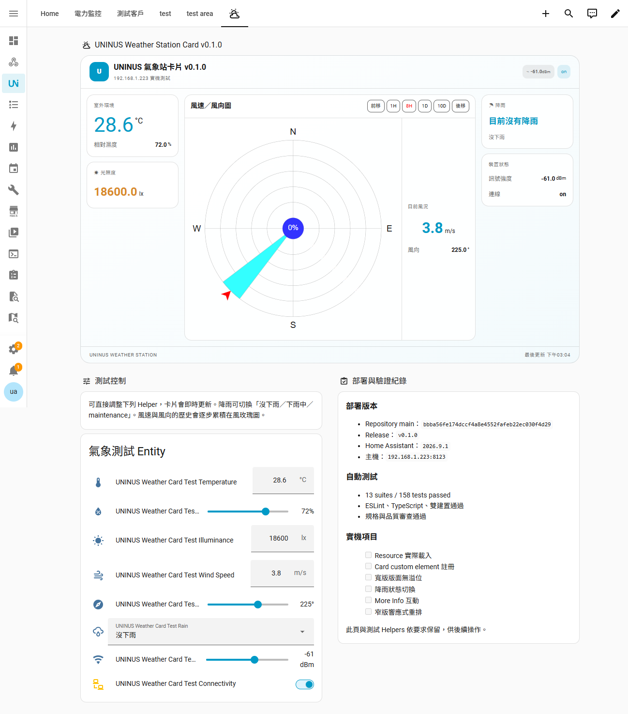

# UNINUS Weather Station Card

A responsive Home Assistant Lovelace card for UNINUS weather-station data, combining current conditions, device status, rain classification, and a historical wind rose in one card.

UNINUS Weather Station Card 是一張適用於 Home Assistant 儀表板的響應式氣象站卡片。介面以繁體中文呈現即時溫度、濕度、照度、降雨、風速、風向、訊號與連線狀態，並整合歷史風向玫瑰圖。

> 本專案尚未發布至 HACS 預設商店；請以「自訂儲存庫」方式安裝。v0.1.2 已在 Home Assistant 2026.9.1（`192.168.1.223`）透過 HACS 完成實機驗證，詳見[驗證紀錄](./docs/live-test/README.md)。

## 功能

- UNINUS 品牌化的氣象站總覽
- 即時溫度、相對濕度、照度、降雨、風速與風向
- 可選的訊號強度與連線狀態
- 歷史風向玫瑰圖、期間選擇與前後移動
- 可自訂降雨感測器的濕／乾狀態字串
- 點擊可用數值即可開啟 Home Assistant `more-info`
- 依卡片寬度自動切換寬版、緊湊與窄版配置
- 沿用上游 Lovelace Windrose Card 的歷史資料、統計資料與進階圖表設定

## 實機畫面



- [完整寬版與 430 px 行動版驗證紀錄](./docs/live-test/README.md)
- [底層風玫瑰期間播放示意](./example/windrose-play-demo-animated.gif)

## 安裝

### HACS 自訂儲存庫

1. 在 HACS 開啟「自訂儲存庫」（Custom repositories）。
2. 加入 `https://github.com/ivanlee1007/uninus-weather-station-card`。
3. 類別選擇 **Dashboard**。
4. 找到 **UNINUS Weather Station Card** 並安裝。
5. 若 HACS 沒有自動加入前端資源，手動加入：

```text
/hacsfiles/uninus-weather-station-card/uninus-weather-station-card.js
```

資源類型選擇 **JavaScript Module**。

### 手動安裝

1. 執行 `npm ci && npm run build`，或取得儲存庫根目錄的 `uninus-weather-station-card.js`。
2. 將檔案複製至 Home Assistant 的 `/config/www/uninus-weather-station-card/`。
3. 在「設定 → 儀表板 → 右上角選單 → 資源」加入：

```text
/local/uninus-weather-station-card/uninus-weather-station-card.js
```

資源類型選擇 **JavaScript Module**。若以 YAML 管理資源：

```yaml
lovelace:
  resources:
    - url: /local/uninus-weather-station-card/uninus-weather-station-card.js
      type: module
```

## 最小設定

以下六個實體是必要項目：風向、至少一個風速，以及溫度、濕度、照度、降雨。

```yaml
type: custom:uninus-weather-station-card
wind_direction_entity:
  entity: sensor.wind_direction
windspeed_entities:
  - entity: sensor.wind_speed
weather_entities:
  temperature:
    entity: sensor.outdoor_temperature
  humidity:
    entity: sensor.outdoor_humidity
  illuminance:
    entity: sensor.outdoor_illuminance
  rain:
    entity: binary_sensor.rain
```

## 完整設定範例

此範例只使用程式目前支援的設定。請將實體 ID 換成自己的實體。

```yaml
type: custom:uninus-weather-station-card
name: UNINUS 校園氣象站
device_label: 戶外環境氣象站
refresh_interval: 300
card_width: 8
disable_animations: false
log_level: WARN
hide_windspeed_bar: true
windspeed_bar_location: bottom

weather_entities:
  temperature:
    entity: sensor.outdoor_temperature
    name: 溫度
    unit: °C
  humidity:
    entity: sensor.outdoor_humidity
    name: 相對濕度
    unit: "%"
  illuminance:
    entity: sensor.outdoor_illuminance
    name: 光照度
    unit: lx
  rain:
    entity: binary_sensor.rain
    name: 降雨
  signal_strength:
    entity: sensor.weather_station_rssi
    name: 訊號強度
    unit: dBm
  connectivity:
    entity: binary_sensor.weather_station_connectivity
    name: 連線

rain_states:
  wet: ["下雨中", "on", "wet"]
  dry: ["沒下雨", "off", "dry"]

wind_direction_entity:
  entity: sensor.wind_direction
  name: 風向
  unit: °
  use_statistics: false
  direction_compensation: 0

windspeed_entities:
  - entity: sensor.wind_speed
    name: 風速
    speed_unit: auto
    output_speed_unit: mps
    use_statistics: false
    windspeed_bar_full: true
    speed_range_beaufort: true
    current_speed_arrow: true

buttons_config:
  location: top
  buttons:
    - type: period_shift
      button_text: 前移
      shift_period: -8h
    - type: period_selector
      button_text: 1H
      period_back: -1h
    - type: period_selector
      button_text: 8H
      period_back: -8h
      active: true
    - type: period_selector
      button_text: 1D
      period_back: -1d
    - type: period_selector
      button_text: 10D
      period_back: -10d
    - type: period_shift
      button_text: 後移
      shift_period: +8h

rose_config:
  wind_direction_count: 16
  first_segment_in_leaves: false
  center_circle:
    enabled: true
    size: 60
    text: ${calm-percentage}%
    text_size: 40

current_direction:
  show_arrow: true
  arrow_size: 50

direction_labels:
  cardinal_direction_letters: NESW
  show_cardinal_directions: true
  show_intercardinal_directions: true

matching_strategy:
  name: direction-first
  log_measurement_counts: false
```

## 根層設定選項

`name`、`device_label`、`weather_entities` 與 `rain_states` 是 UNINUS 外框新增的 API；其餘列出的設定由內建 Windrose 引擎實際讀取。

| 選項 | 型別 | 必要 | 預設 | 說明 |
|---|---|:---:|---|---|
| `type` | string | 是 | — | 固定為 `custom:uninus-weather-station-card`。 |
| `name` | string | 否 | `UNINUS 氣象站` | 卡片主標題。空字串也會使用預設值。 |
| `device_label` | string | 否 | `外部環境氣象站` | 裝置副標題。 |
| `weather_entities` | object | 是 | — | 即時環境與裝置實體，見下表。 |
| `rain_states` | object | 否 | 見「降雨狀態」 | 自訂濕／乾狀態字串陣列。 |
| `wind_direction_entity` | object | 是 | — | 歷史與即時風向實體，見下表。 |
| `windspeed_entities` | object[] | 是 | — | 至少一個；第一個也顯示為目前風速。 |
| `refresh_interval` | number | 否 | `300` | 重新抓取歷史資料的秒數。 |
| `data_period` | object | 否 | — | 固定查詢期間；若使用啟用中的 `period_selector`，請勿同時設定。 |
| `buttons_config` | object | 否 | 內建 1H／8H／1D／10D 與前後移按鈕 | 支援 `period_selector`、`period_shift`、`period_shift_play`、`windrose_speed_selector`。 |
| `hide_windspeed_bar` | boolean | 否 | `true` | 隱藏 Windrose 引擎的速度條；不影響右側目前風速。 |
| `windspeed_bar_location` | `bottom` \| `right` | 否 | `bottom` | 未隱藏時的速度條位置。 |
| `card_width` | number | 否 | `4` | Home Assistant sections 配置的建議欄寬。 |
| `disable_animations` | boolean | 否 | `false` | 關閉玫瑰葉片與速度條動畫。 |
| `rose_config` | object | 否 | 引擎預設 | 玫瑰圖方向數、圓圈、背景、透明度等。 |
| `current_direction` | object | 否 | `{show_arrow: true}` | 目前風向箭頭設定。 |
| `direction_labels` | object | 否 | 引擎預設 | 方位字母、層級、字級與自訂標籤。 |
| `matching_strategy` | object | 否 | `direction-first` | 可用 `direction-first`、`speed-first`、`time-frame`、`full-time`。 |
| `compass_direction` | object | 否 | 關閉 | 以方位實體旋轉玫瑰圖。 |
| `corner_info` | object | 否 | — | 玫瑰圖四角的額外實體資訊。 |
| `text_blocks` | object | 否 | — | 玫瑰圖上／下方文字與統計模板。 |
| `actions` | object | 否 | — | Windrose 區域、速度條與角落的 HA 動作。 |
| `colors` | object | 否 | 引擎／主題預設 | 玫瑰圖與速度條顏色。 |
| `log_level` | string | 否 | `WARN` | `NONE`、`ERROR`、`WARN`、`INFO`、`DEBUG` 或 `TRACE`。 |

### `weather_entities` 實體

| 鍵 | 必要 | 用途 |
|---|:---:|---|
| `temperature` | 是 | 溫度與頁尾最後更新時間。 |
| `humidity` | 是 | 相對濕度。 |
| `illuminance` | 是 | 光照度。 |
| `rain` | 是 | 降雨原始狀態與分類。 |
| `signal_strength` | 否 | 頁首狀態與裝置狀態。 |
| `connectivity` | 否 | 頁首與裝置連線狀態；`off`、`false`、`disconnected` 顯示為非連線。 |

每個 `weather_entities` 項目都支援：

| 選項 | 型別 | 必要 | 預設／行為 |
|---|---|:---:|---|
| `entity` | string | 是 | Home Assistant 實體 ID。 |
| `name` | string | 否 | 使用實體的 `friendly_name`；若也沒有則留空／使用介面標籤。 |
| `unit` | string | 否 | 使用實體的 `unit_of_measurement`。 |

### `wind_direction_entity`

| 選項 | 型別 | 必要 | 預設／說明 |
|---|---|:---:|---|
| `entity` | string | 是 | 風向實體 ID。數值視為角度，字串可用方位字母。 |
| `name` | string | 否 | 目前風向的顯示名稱。 |
| `unit` | string | 否 | 目前風向顯示單位；否則使用實體單位。 |
| `attribute` | string | 否 | 使用指定 attribute 而非 state 取得歷史資料；不可與統計資料併用。 |
| `use_statistics` | boolean | 否 | `false`；使用 Home Assistant statistics。 |
| `statistics_period` | string | 否 | `5minute`；也支援 `hour`、`day`、`week`、`month`、`year`。 |
| `direction_compensation` | number | 否 | `0`；角度補償。 |
| `direction_letters` | string | 否 | 五個解析字元，例如 `NESWX`。 |

### `windspeed_entities[]`

| 選項 | 型別 | 必要 | 預設／說明 |
|---|---|:---:|---|
| `entity` | string | 是 | 風速實體 ID。 |
| `name` | string | 否 | 顯示名稱。 |
| `unit` | string | 否 | UNINUS 目前風速顯示單位；否則使用實體單位。 |
| `attribute` | string | 否 | 使用指定 attribute 取得歷史資料；不可與統計資料併用。 |
| `use_statistics` | boolean | 否 | `false`。 |
| `statistics_period` | string | 否 | `5minute`；亦支援 `hour`、`day`、`week`、`month`、`year`。 |
| `statistics_type` | `min` \| `max` \| `mean` | 否 | `mean`。 |
| `use_for_windrose` | boolean | 否 | 若皆未指定，使用第一個實體。 |
| `speed_unit` | string | 否 | `auto`；或 `mps`、`bft`、`kph`、`mph`、`fps`、`knots`。 |
| `output_speed_unit` | string | 否 | `mps`；或 `kph`、`mph`、`fps`、`knots`。 |
| `output_speed_unit_label` | string | 否 | 覆寫輸出單位文字。 |
| `windspeed_bar_full` | boolean | 否 | `true`；是否顯示所有速度區間。 |
| `speed_range_beaufort` | boolean | 否 | `true`；使用蒲福風級區間。 |
| `speed_range_step` / `speed_range_max` | number | 否 | 自訂等距區間，兩者須同時設定，且須關閉蒲福區間。 |
| `speed_ranges` | object[] | 否 | 自訂 `{from_value, color}` 區間；須從 `0` 開始並關閉蒲福區間。 |
| `dynamic_speed_ranges` | object[] | 否 | 自訂 `{average_above, step, max}`；第一項須從 `average_above: 0` 開始。 |
| `current_speed_arrow` | boolean | 否 | `false`。 |
| `current_speed_arrow_size` | number | 否 | `40`。 |
| `current_speed_arrow_location` | string | 否 | 底部速度條為 `above`，右側速度條為 `left`。 |
| `bar_render_scale` | string | 否 | `windspeed_relative`；亦可為 `absolute`、`percentage_relative`。 |
| `bar_label_text_size` | number | 否 | `40`。 |
| `bar_speed_text_size` | number | 否 | `40`。 |
| `bar_percentage_text_size` | number | 否 | `40`。 |
| `speed_compensation_factor` | number | 否 | `1`。 |
| `speed_compensation_absolute` | number | 否 | `0`。 |

## 降雨狀態預設值

比對會先去除前後空白並忽略大小寫：

```yaml
rain_states:
  wet: ["下雨中", "on"]
  dry: ["沒下雨", "off"]
```

- 符合 `wet`：顯示「偵測到降雨」。
- 符合 `dry`：顯示「目前沒有降雨」。
- 有值但未符合：顯示「未知降雨狀態」。
- 實體不存在、`unknown` 或 `unavailable`：顯示資料無法使用。

自訂陣列會取代該分類的預設陣列，不會自動合併。

## 響應式模式

模式依卡片本身寬度（不是瀏覽器寬度）判定：

| 模式 | 寬度 | 配置 |
|---|---:|---|
| `wide` | ≥ 760 px | 環境、風況、裝置三欄。 |
| `compact` | 560–759 px | 主要內容兩欄，裝置區移至下方。 |
| `narrow` | 391–559 px | 單欄；風玫瑰與目前風況上下排列。 |
| `small` | ≤ 390 px | 窄版配置，且環境與裝置子區塊也改為單欄。 |

所有模式都由卡片的 `ResizeObserver` 依卡片本身寬度套用 class，不依賴瀏覽器 viewport。

## 疑難排解

- **卡片類型不存在**：確認資源 URL 指向 `uninus-weather-station-card.js`、類型是 module，並重新載入前端。
- **更新後仍顯示舊版**：清除瀏覽器快取，或暫時在資源 URL 後加查詢字串（例如 `?v=dev`）。
- **顯示必要實體錯誤**：檢查最小設定中的六類實體都有非空白 `entity`。
- **顯示 `—`**：該實體不存在，或狀態為 `unknown`／`unavailable`。
- **風玫瑰沒有歷史資料**：確認 Recorder 保留期間涵蓋查詢範圍；若啟用 statistics，確認實體確實產生對應統計資料。
- **attribute 與 statistics 錯誤**：引擎不支援同一實體同時設定 `attribute` 與 `use_statistics: true`。
- **期間設定衝突**：不要同時設定 `data_period` 與一個啟用中的 `period_selector`。
- **自訂速度區間錯誤**：關閉 `speed_range_beaufort`，且不要混用固定步距、自訂區間與動態區間。

## 開發

```bash
npm ci
npm test
npm run lint
npm run typecheck
npm run build
```

`npm run build` 會同時產生：

- `./uninus-weather-station-card.js`（HACS 根目錄發佈檔）
- `./build/uninus-weather-station-card.js`（本機建置輸出）

若要驗證上游相容的原始卡片建置：

```bash
npm run esbuild-windrose
```

輸出為 `build/windrose-card.js`。

## 上游、授權與歸屬

本專案衍生自 [aukedejong/lovelace-windrose-card](https://github.com/aukedejong/lovelace-windrose-card)，沿用其 Windrose 引擎程式。上游 README 與 `package.json` 宣告 MIT 授權；上游儲存庫未提供可直接複製的 LICENSE 檔，也未在這些來源中提供可確認的版權持有人名稱，因此本專案不臆測該名稱。

本專案採用 [MIT License](./LICENSE)。衍生內容與來源說明見 [NOTICE](./NOTICE)。
