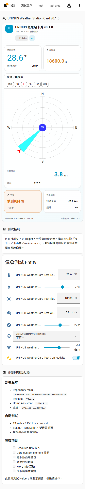

# Home Assistant 實機驗證結果

- 驗證時間：2026-09-12 18:00（Asia/Taipei）
- Home Assistant 主機：`192.168.1.223:8123`
- Home Assistant Core：`2026.9.1`
- Dashboard：`lovelace-uninus`
- View：`weather-card-test`
- 可操作頁面：`http://192.168.1.223:8123/lovelace-uninus/weather-card-test`
- GitHub release：`v0.1.2`
- Lovelace type：`custom:uninus-weather-station-card`

## 部署內容

- HACS repository：`ivanlee1007/uninus-weather-station-card`
- HACS 狀態：`installed`，`installed_version == available_version == v0.1.2`
- 唯一 Lovelace resource：`/hacsfiles/uninus-weather-station-card/uninus-weather-station-card.js`
- Resource 類型：`module`
- Release bundle SHA-256（LF）：`c15cc985c052a051441904f7294bd45942faa5eb4e38c203fbdecbb401890dfd`
- 實機頁面已確認載入 HACS resource（含 `hacstag` cache key），並完成 `uninus-weather-station-card` custom element 註冊。

## 保留的可操作測試 Helpers

- `input_number.uninus_weather_card_test_temperature`
- `input_number.uninus_weather_card_test_humidity`
- `input_number.uninus_weather_card_test_illuminance`
- `input_number.uninus_weather_card_test_wind_speed`
- `input_number.uninus_weather_card_test_wind_direction`
- `input_select.uninus_weather_card_test_rain`
- `input_number.uninus_weather_card_test_signal_strength`
- `input_boolean.uninus_weather_card_test_connectivity`

上述 Helpers 與測試 View 會保留。可在 View 內直接調整數值、切換降雨狀態和連線狀態，觀察卡片即時更新。

## 驗證結果

- [x] GitHub feature branch 經 Pull Request 合併到 `main`
- [x] GitHub Release 與 HACS `filename` 封裝
- [x] 13 個 Jest suites、158 項 tests 通過
- [x] ESLint、TypeScript、UNINUS build、Windrose build 通過
- [x] Resource HTTP 200、唯一註冊、實際 script URL 一致
- [x] Custom element 註冊成功
- [x] 1032 px 卡片寬版：`wide`，`scrollWidth === clientWidth`
- [x] 414 px 卡片窄版：`narrow`，卡片及頁面無水平溢位
- [x] 430 px 行動版截圖：無重疊、裁切或水平溢位
- [x] 點擊溫度數值成功開啟對應 Home Assistant More Info
- [x] 以測試控制將降雨由「沒下雨」切換為「下雨中」，卡片即時顯示「偵測到降雨」
- [x] 測試後將降雨恢復為「沒下雨」
- [x] `1H` 與 `8H` period selector 可切換，active 狀態正確更新
- [x] period shift 按鈕可操作且無新增卡片錯誤
- [x] Dashboard storage 設定回讀包含 3 個 sections、主卡片與 8 個控制 Helpers

## 實機截圖

### 寬版

### 430 px 行動版

## 保留說明

依測試要求，下列內容不移除：Lovelace resource、`weather-card-test` View、8 個測試 Helpers、View 內的測試結果與本文件／截圖。
